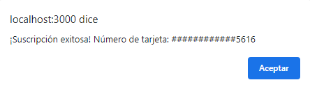

# Card-Validation
El objetivo de este proyecto es integrar a una página web un validador de tarjeta usando el logaritmo de Luhn.
Se realizó en especial para una tienda de ropa que tiene opción de inscribirse a la tienda, pagar un monton por esta suscripción y recibir sus próximas tres piezas en la talla y el color que el cliente deseé.
El lenguaje utilizado para la funcionalidad ha sido Javascript.

## Quiénes son los principales usuarios de producto:
Este producto lo pueden usar las tiendas que requieran válidar tarjetas.

## Guía de uso:
El código lo que hace es que una vez que el usuario da el número de la tarjeta, lo revierte, a cada posición par lo multiplica por dos y si el número resultado de está multiplicación par es igual o mayor que diez entonces le restará 9, después sumará todos los números y dividirá esa suma entre 10, y si el resultado es múltiplo de 10, entonces tendremos qué es una tarjeta válida. Además le dirá al usuario que esa tarjeta es válida, pero solo mostrará los últimos cuatro números. 

## Ejemplos o demostraciones:
Si al ejecutar el código, el número no es válido, nos debe salir un alert con algo así:

Ahora, si el número sí es válido, nos debe salir un alert con un texto así:
